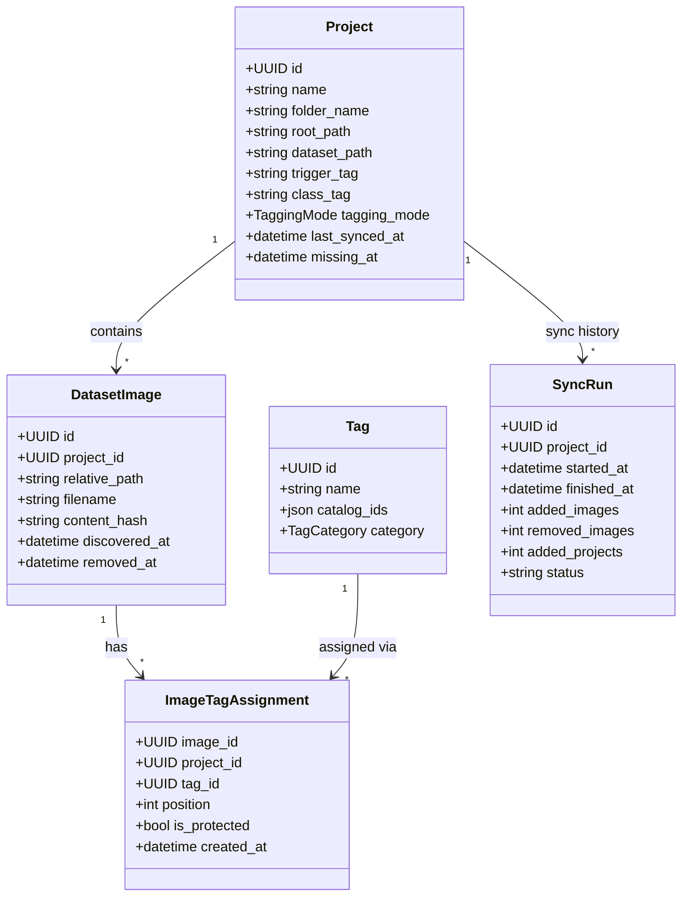

# Project Dataset Workflow

## Overview

This feature centers on a filesystem-backed workflow while still preserving browser-driven image upload for remote use.
The application is configured with a root directory on the backend.
Each subfolder under that root is treated as a project, and each project is expected to contain a fixed `dataset/` folder with the images to tag.

## Goals

- Discover projects from a configured filesystem root.
- Detect new projects added directly in the filesystem after the app has already been used.
- Allow users to create a new project from the UI.
- Allow users to upload images from the UI into a selected project when they do not have direct filesystem access to the backend machine.
- Persist project metadata in the database.
- Track project-specific trigger tags, one class tag per project, and one tagging mode per project.
- Track dataset image paths and the tags assigned to each image.
- Support source-aware tagging from `e621`, `booru`, and globally shared user-defined tags.
- Allow the UI to sync database state with filesystem changes when images are added or removed outside the app.
- Import comma-separated sidecar `.txt` tags during sync when present.
- Gracefully handle projects whose folders were deleted or moved outside the app.

## Filesystem convention

Given a configured root such as:

```text
/home/pablo/projects/ai/lora_training
```

The app treats the structure like this:

```text
/home/pablo/projects/ai/lora_training/
  project-a/
    dataset/
      image-001.png
      image-002.png
  project-b/
    dataset/
      image-010.png
```

Rules:

- Each direct child folder of the configured root is a project.
- Each project must have a `dataset/` folder.
- The `dataset/` folder contains the images to tag.

## Core behavior

### Project discovery

- Read the configured root path from backend settings.
- Discover each project from a direct child directory.
- Provide a project discovery or refresh action so the app can detect new project folders added outside the UI.
- When a new project folder is discovered, import it into the database if it contains the expected `dataset/` folder.
- If a previously known project folder no longer exists, mark that project as missing instead of failing the entire discovery flow.
- Default the project's `trigger_tag` to the project folder name on first import.
- Require one `class_tag` per project.
- Default the project's `tagging_mode` to `e621`.

### Metadata persistence

The database should keep track of:

- project name
- project folder name/path
- trigger tag
- class tag
- tagging mode
- each dataset image path
- the tags assigned to each image

### Project creation

The UI should expose a create-project button.
A project creation flow should:

- create a new project folder under the configured root
- create the fixed `dataset/` subfolder for that project
- initialize project metadata in the database
- default the `trigger_tag` to the new folder name
- require or prompt for the project's `class_tag`
- default the `tagging_mode` to `e621`

### UI upload fallback

The UI should still expose a way to upload images directly from the browser.
This is needed when a user is connected remotely, such as from a phone, and cannot place files directly on the backend machine.

A UI upload flow should:

- require the user to select a target project first
- write uploaded images into that project's `dataset/` folder on the backend machine
- create or refresh the corresponding database image records
- behave consistently with filesystem-backed images so later syncs still work

### Sync behavior

The UI should expose a sync action for a selected project.
A sync operation should:

- add new files that appear in the `dataset/` folder
- treat files that no longer exist in the dataset folder as deleted
- keep project metadata such as `trigger_tag` and `class_tag`
- preserve image tag assignments for images that still exist
- import tags from sibling comma-separated `.txt` files when present
- resolve sidecar tags against the project's active tagging mode plus globally shared user-defined tags
- preserve trigger tag as the first image tag and class tag as the second
- mark a project as missing and surface that state in the UI when its project folder or dataset folder can no longer be found

## Recommended data model

### Project

Stores project-level metadata.

- `name`
- `folder_name`
- `root_path`
- `dataset_path`
- `trigger_tag`
- `class_tag`
- `tagging_mode`
- `last_synced_at`
- `missing_at` or equivalent missing-state metadata

### DatasetImage

Stores one row per image discovered in a project's `dataset/` folder.

- `project_id`
- `relative_path`
- `filename`
- `content_hash` or `mtime`/`size` metadata for sync support
- `discovered_at`
- `removed_at` or equivalent deleted-state metadata for images missing from the filesystem after sync

### Tag

Stores globally shared tags by unique name.

- `name`
- `catalog_ids` JSON object keyed by catalog name
- `category`

The `catalog_ids` object holds source-specific external IDs, such as:

```json
{
  "e621": "123",
  "booru": "456"
}
```

This allows one TailFlow tag row to represent the same tag across multiple external catalogs.

### ImageTagAssignment

Stores one assigned tag per image within a project.

- `image_id`
- `project_id`
- `tag_id`
- `position`
- `is_protected`

Trigger and class tags are represented as protected assignments and always occupy the first two positions.

## Class diagram



## Suggested implementation phases

### Phase 1 - Configuration and setup

- Add a backend env setting for the project root path.
- Update `make install`, `.env.example`, and `README.md` so fresh clones are prompted for the project root when needed.
- Validate startup behavior when the path is missing or invalid.

### Phase 2 - Backend data model and migration

- Add persistent project metadata to the database.
- Add dataset image path tracking and source-aware image-tag relationships.
- Add fields for `trigger_tag`, `class_tag`, `tagging_mode`, sync timestamps, and missing-state handling.
- Add a shared global tag table with unique names and a `catalog_ids` JSON mapping for external source IDs.
- Create the Alembic migration(s) for the new schema.

### Phase 3 - Backend project discovery and sync

- Implement backend logic to scan the configured root for project folders.
- Import newly discovered projects that contain `dataset/`.
- Mark missing projects gracefully when their folders disappear.
- Treat missing dataset images as deleted during sync.
- Import sidecar comma-separated `.txt` tags during sync and reconcile them with source-aware tag lookup.

### Phase 4 - Backend project creation and UI upload fallback

- Add backend support for creating a project folder plus its `dataset/` subfolder.
- Add backend support for uploading browser-selected images into a selected project's `dataset/` folder.
- Ensure uploaded images and filesystem-discovered images share the same persistence/sync model.

### Phase 5 - Frontend project browser

- Replace the current upload-first page with project discovery and selection.
- Show project metadata such as `trigger_tag`, `class_tag`, `tagging_mode`, image count, and missing-state.
- Add actions for refresh/discover and project sync.

### Phase 6 - Frontend project creation and remote upload

- Add a create-project button and form in the UI.
- Add remote image upload into the selected project for phone/remote workflows.
- Surface validation and failure states clearly.

### Phase 7 - Tagging workflow integration

- Connect discovered project images to a source-aware image/tag workflow.
- Ensure project-level `class_tag`, `trigger_tag`, and `tagging_mode` are visible and editable where appropriate.
- Keep trigger/class tags protected on each image and editable only from the project metadata screen.
- Allow interactive tagging to switch between `e621` and `booru` while always including globally shared user-defined tags.
- Prompt before creating unknown tags during manual tagging.
- Preserve image tags across syncs for images that still exist.

### Phase 8 - Test coverage and polish

- Add backend tests for project discovery, creation, sync, missing-project handling, and upload fallback.
- Add frontend tests for project selection, create-project flow, sync, and remote upload UX.
- Finalize docs and validate the end-to-end workflow.

## Constraints and invariants

- `trigger_tag` is project-specific and defaults to the folder name when a project is first discovered.
- `class_tag` exists exactly once per project.
- `tagging_mode` is project-specific and defaults to `e621`.
- `dataset_path` is derived from `<project>/dataset`.
- A project created in the UI must create both the project folder and its `dataset/` subfolder on disk.
- A project's images are primarily sourced from the filesystem, but the UI may also upload images into the selected project's `dataset/` folder for remote workflows.
- Tag source imports from CSV must treat source IDs as external IDs stored inside `catalog_ids`, not as globally unique identifiers.
- User-defined tags are globally shared across all projects and available regardless of the selected tagging mode.
- A single tag row may represent the same tag across both external catalogs when `catalog_ids` contains multiple entries.
- Every image must keep trigger tag first and class tag second.
- Trigger/class tags cannot be deleted from the image tagging UI.
- Trigger/class tags can only be changed from the project metadata UI.
- Missing projects should be represented explicitly in application state instead of causing hard failures during discovery or sync.
- Sync is the mechanism that reconciles the database with filesystem additions and removals, including newly discovered project folders when project discovery is run.
- Missing dataset images should be assumed deleted and reflected as such in database state during sync.
- Sync should also reconcile sibling comma-separated `.txt` tag files when present.

## Planned UI direction

The current upload page should evolve into a project-selection workflow.
The expected flow is:

1. discover or refresh projects from the configured root when new folders are added in the filesystem
2. create a new project from the UI when needed
3. choose a project discovered from the configured root
4. inspect its metadata (`trigger_tag`, `class_tag`, `tagging_mode`, image counts, missing-state if applicable)
5. upload images from the UI into the selected project when working remotely
6. run sync when the filesystem changes
7. browse the gallery with per-image tag counts and open an image detail view without losing project context
8. move between previous and next images directly from the image detail view when reviewing a project dataset
9. handle missing projects gracefully by surfacing that the folder is gone or moved and disabling actions that require the filesystem path
10. work on image tags for images currently tracked from the project's `dataset/` folder when the project is present
11. tag images in either `e621` or `booru` mode while always keeping globally shared user-defined tags available
12. keep trigger/class tags protected on the image detail screen and edit them only from the project metadata screen
