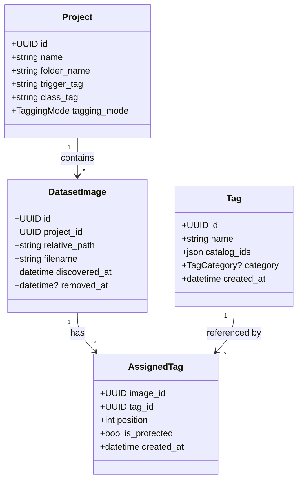

# Multi-source tag import and project tagging plan

## Objective

Document the planned work for:

- importing source-backed tags from bundled CSV assets
- supporting multiple tag sources (`e621`, `booru`, and user-defined)
- adding per-project tagging mode
- protecting project trigger/class tags on every image
- importing comma-separated sidecar `.txt` tags during dataset sync

This document is a design artifact only. It does not implement the import script or change the current backend/frontend code.

## Current state

- The repository already ships two source datasets in `assets/`:
  - `assets/e621-tags-list.csv`
  - `assets/booru-tags-list.csv`
- Both CSV files currently use the same shape:

  ```text
  id,name,category,post_count
  ```

- The current global tag model in `backend/app/models/tag.py` stores:
  - `id`
  - `name`
  - `category`
  - `created_at`
- The current schema does **not** store:
  - tag source
  - source-specific external ID
  - project tagging mode
  - protected trigger/class assignments
  - sidecar `.txt` sync metadata
- Project image tagging is currently project-local and free-form:
  - missing tags are silently created
  - any assigned tag can be removed
  - there is no source switch in the image tagging UI

## Confirmed requirements

### Tag sources

- CSV `id` values are **external IDs**, not TailFlow primary keys.
- External IDs can collide across sources and must therefore be namespaced by source.
- TailFlow currently has three tag sources:
  - `e621`
  - `booru`
  - `user`

### Tagging mode

- Tagging mode can be switched between `e621` and `booru`.
- `e621` is the default mode.
- A project has an associated tagging mode.
- User-defined tags are available regardless of the selected mode.

### Trigger and class tags

- Every image must always include:
  1. trigger tag as the first tag
  2. class tag as the second tag
- Trigger/class tags cannot be deleted from an image.
- Trigger/class tags can only be changed from the project metadata screen.
- If the class tag already exists in the selected tagging mode, do not create a duplicate user-defined tag for it.

### Unknown tags

- If a user enters a tag that does not exist, the UI must ask whether the user wants to create it.

### Sync behavior

- During dataset sync, if a corresponding sibling `.txt` file exists, import tags from it.
- `.txt` tags are comma-separated.

## Planned design

### 1. Shared global tag catalog

The global catalog should use one row per unique tag name, even when the same tag appears in multiple external catalogs.

Planned tag fields:

- internal `id` (UUID)
- `name`
- `catalog_ids` JSON object mapping catalog name to external ID
- `category`
- `created_at`

Planned rules:

- `name` should be globally unique.
- `catalog_ids` stores per-catalog external IDs, for example `{ "e621": "123", "booru": "456" }`.
- A tag present in both external catalogs should still resolve to a single TailFlow tag row.
- User-defined tags should use an empty `catalog_ids` object until they are matched or imported from an external catalog later.
- CSV IDs must always be treated as external source IDs, never as internal identifiers.

### 2. Project tagging mode

Each project should store a `tagging_mode` enum with these goals:

- default to `e621`
- drive catalog lookups during tagging
- determine the default source context used during `.txt` sync
- remain editable from the project metadata screen

### 3. Assigned project image tags

Image-level assignments should reference shared tags and enforce trigger/class protections.

The assigned-tag model should be able to express:

- link to a shared global tag
- display/order position
- protection flag for trigger/class tags

Behavioral requirements:

- every image always contains trigger first and class second
- protected trigger/class assignments are not removable in API or UI
- when project metadata changes trigger/class values, assignments are updated from the project screen rather than from individual images

### 4. Globally shared user-defined tags

User-defined tags should be modeled as globally shared catalog entries.

Implications:

- they are visible in every project
- they are available in both `e621` and `booru` tagging modes
- they can be reused by manual tagging and `.txt` sync
- they should live in the global tag table rather than only in project-local assignment tables
- they can be represented by a unique tag name with an empty `catalog_ids` object

### 5. Unknown tag creation flow

When the user types a tag that is not found:

- first check whether a global tag with that exact name already exists
- then check whether that tag is available in the active mode through `catalog_ids`
- then check globally shared user-defined tags
- if still missing, prompt the user before creating a new shared tag row

This confirmation applies to interactive tagging only.

### 6. Sidecar `.txt` sync

For each image discovered during sync:

- look for a sibling `.txt` file with the same basename
- read comma-separated tags
- trim whitespace and ignore empty entries
- resolve each tag by its global unique name
- use `catalog_ids` to determine whether the tag belongs to the active project tagging mode
- fall back to globally shared user-defined tags when no catalog-backed mapping exists
- preserve trigger/class as the first two assignments regardless of sidecar content

Because sync is non-interactive, unknown `.txt` tags should auto-create or reuse globally shared user-defined tags.

## Reference tables

### Tag source enum

| Enum value | Meaning | Stored in `catalog_ids`? | Available in mode |
| --- | --- | --- | --- |
| `e621` | Imported from the e621 CSV export | Yes | `e621` mode |
| `booru` | Imported from the booru CSV export | Yes | `booru` mode |
| `user` | Created inside TailFlow | No; represented by a tag row with no external mapping | All modes |

### Project tagging mode enum

| Enum value | Meaning | Default |
| --- | --- | --- |
| `e621` | Use the e621 source catalog for primary tag lookup | Yes |
| `booru` | Use the booru source catalog for primary tag lookup | No |

### Tag category enum mapping

This is the planned mapping for source category IDs used by the bundled assets.

| Raw category ID | Source label | Planned enum value | Notes |
| --- | --- | --- | --- |
| `0` | General | `general` | Default descriptive tags |
| `1` | Artist | `artist` | Creator tags |
| `2` | Contributor (silver) | `contributor` | Present in e621 mapping |
| `3` | Copyright | `copyright` | Franchise or property tags |
| `4` | Character | `character` | Character identity tags |
| `5` | Species | `species` | Species taxonomy tags |
| `6` | Invalid | `invalid` | Tags that should not be used normally |
| `7` | Meta | `meta` | Administrative or descriptive meta tags |
| `8` | Lore | `lore` | World or universe lore tags |
| `9` | New/Unknown category | `unknown` | Explicit fallback bucket |

## Draft class diagram



## Implementation surfaces

Likely implementation touchpoints:

- `backend/app/models/tag.py`
- `backend/app/models/project.py`
- `backend/app/models/dataset_image.py`
- `backend/app/schemas/tag.py`
- `backend/app/schemas/project.py`
- `backend/app/api/routes/tags.py`
- `backend/app/api/routes/projects.py`
- `backend/app/services/projects.py`
- `backend/alembic/versions/`
- import script under `backend/` or `scripts/`
- `frontend/src/api/index.ts`
- `frontend/src/stores/images.ts`
- `frontend/src/stores/projects.ts`
- `frontend/src/pages/ImageDetailPage.vue`
- `frontend/src/pages/UploadPage.vue`
- `backend/tests/test_tags.py`
- `backend/tests/test_projects.py`
- relevant frontend tests in `frontend/src/__tests__/`

## Notes

- `assets/readme.md` is the current source for the e621 category ID meanings.
- `docs/project-dataset-workflow.md` should stay aligned with the project-level tagging behavior described here.
- The shared-tag approach means many images can reference the same tag row, and catalog overlap is handled inside `catalog_ids` rather than by duplicating tag rows.
- The current branch is `feature/tags-seeding`, so this work is already planned on a non-`main` branch.
